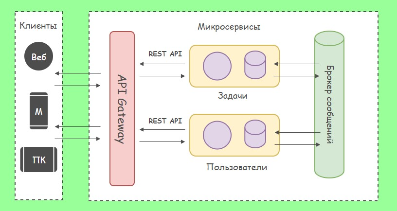

### ПРИМЕНЕНИЕ МИКРОСЕРВИСНОЙ АРХИТЕКТУРЫ  ПРИ РАЗРАБОТКЕ ПРОГРАММНОГО ОБЕСПЕЧЕНИЯ.

Для демонстрации работы микросервисной архитектуры рассмотрим систему управления задачами (Task Manager). Структура проекта Task Manager приведена на рисунке.
При реализации данного решения оно было разделено на три подпроекта:
1. Task.Microservice - проект создан на ASP.NET Core WebAPI. В качестве базы данных использовано PostgreSQL.
2. Users.Microservice - создан аналогично с Task.Microservice.
3. Task Manager.APIGateway - это промежуточный слой между клиентом и микросервисами, который упрощает доступ к API и управление ими.

В Task.Microservice реализованы следующие уровни:
-	Уровень Domain - хранит классы, касающиеся предметной области.
-	Уровень Controllers - отвечает за принятие и обработку запросов.
-	Уровень Infrastructure - реализует взаимодействие с базой данных.
-	Уровень Services - операции (действия).

При реализации рассматриваемого проекта использовался протокол RabbitMQ. Работа данного сервиса во многом похож на паттерн "Издатель/Подписчик". Для запуска RabbitMQ был создан docker контейнер.

